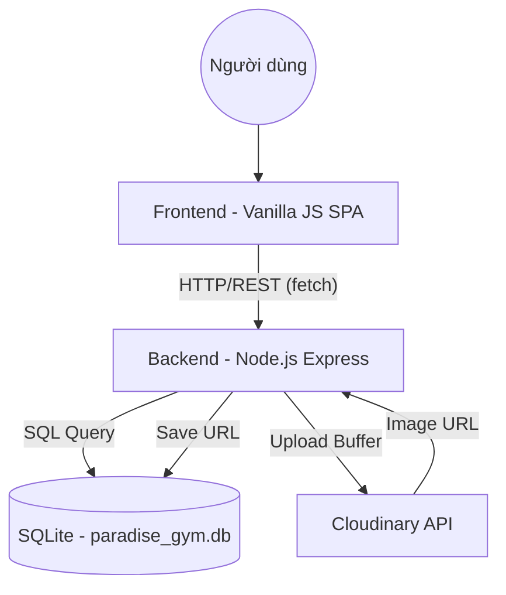

# 🏛️ Kiến Trúc Hệ Thống — Paradise GYM

> Cập nhật lần cuối: 29/05/2026 — Sửa lỗi ReferenceError, Khóa tiền hoàn hủy gói & Đồng bộ Trạng thái giao dịch di động.

---

## 1. Tổng Quan Dự Án

- **Tên**: Paradise GYM Management System
- **Mục tiêu**: Hệ thống quản lý phòng gym toàn diện (Hội viên, PT, Gói tập, Lịch tập, Doanh thu).
- **Stack chính**: 
    - **Frontend**: HTML5, Vanilla JS (SPA), Tailwind CSS (Design System Material 3).
    - **Backend**: Node.js (ESM), Express.
    - **Database**: SQLite (better-sqlite3) + Cloudinary (Image Storage).

---

## 2. Sơ Đồ Kiến Trúc Tổng Thể

---

## 3. Các Thành Phần Hệ Thống

### 3.1. Frontend (Multi-Portal SPA Architecture)
- **Vị trí**: `FE/`
- **3 Portal riêng biệt theo role**:
    - `index.html` + `assets/js/app.js` — Admin / Lễ tân (toàn quyền quản lý)
    - `pt-portal.html` + `assets/js/pt-portal.js` — PT (xem lịch cá nhân, học viên, hồ sơ)
    - `member-portal.html` + `assets/js/member-portal.js` — Hội viên (xem gói tập, lịch tập, vào/ra, hồ sơ)
- **Dữ liệu**: `assets/js/api.js` (Fetch wrapper) & `assets/js/auth.js` (Auth + redirect theo role).
- **Styles**: Tailwind CDN + `assets/css/main.css` — Custom Material 3 Glassmorphism components.
- **Logic trang Admin**: `assets/js/pages/*.js` — Các module chức năng riêng biệt.

### 3.2. Backend (REST API)
- **Vị trí**: `BE/`
- **Controller/Route**: Chia theo module nghiệp vụ (auth, members, packages, v.v.).
- **Middleware**:
    - `auth.js`: Xác thực JWT.
    - `role.js`: Phân quyền dựa trên `quyen_json`.
    - `upload.js`: Multer memory storage.
    - `audit.js`: Ghi nhật ký hành động nhạy cảm.

### 3.3. Database
- **Engine**: SQLite (tối ưu WAL mode cho hiệu năng cao).
- **Schema**: `paradise_gym_v2.sql`.
- **Triggers**: Tự động tính doanh thu và cập nhật trạng thái gói tập.

---

## 4. Cơ Sở Dữ Liệu (Bảng chính)

| Tên bảng | Mô tả |
|----------|-------|
| `tai_khoan` | Tài khoản đăng nhập (Hashed password). |
| `ho_so` | Thông tin cá nhân Hội viên / PT / Nhân viên. |
| `vai_tro` | Phân quyền hệ thống (JSON-based RBAC). |
| `goi_tap` | Danh mục gói tập phòng gym. |
| `dang_ky_goi_tap`| Lịch sử đăng ký và thanh toán của hội viên (Thêm cột payos_order_code, payos_status, chi_nhanh_mua ở Migration v11). |
| `lich_tap` | Chi tiết các buổi tập của hội viên với PT (Thêm cột pt_xac_nhan, hv_xac_nhan ở Migration v13). |
| `doanh_thu` | Tổng hợp doanh thu tự động qua Triggers. |
| `audit_log` | Nhật ký thay đổi dữ liệu nhạy cảm. |
| `cau_hinh` | Cấu hình hệ thống (giờ cron, TTL QR, v.v.). |
| `thong_bao` | Thông báo hệ thống: **16 loại** (6 cron + 10 realtime), phân quyền admin/le_tan/ca_hai, tự động xóa sau 30 ngày. Migration v4 bổ sung `cap_nhat_buoi_tap`. |

---

## 5. Danh Sách API Endpoints (Tóm tắt)

| Module | Endpoints | Chức năng chính |
|--------|-----------|-----------------|
| **Auth** | `/api/auth/login`, `/me`, `/doi-mat-khau` | Xác thực, phân quyền. |
| **Members** | `/api/members`, `/:id/package`, `/:id/avatar`, `/birthday`, `/me/profile` | Quản lý hội viên, đăng ký gói, sinh nhật, tự xem hồ sơ. |
| **Members (Gia hạn)** | `/api/members/me/package-request` [POST], `/api/members/me/payos-status/:orderCode` [GET] | Đăng ký gia hạn/mua gói tập (tiền mặt/PayOS) và check trạng thái thanh toán PayOS. |
| **Branches** | `/api/branches` [GET] | Trả về danh sách 12 chi nhánh từ file JSON dùng chung (công khai). |
| **Trainers** | `/api/trainers`, `/:id/schedules` | Quản lý PT và lịch dạy. |
| **PT Schedules** | `/api/pt/schedules`, `PATCH /:id/hoan-tac` | Đặt lịch tập, xác nhận, hủy, hoàn tác buổi tập. |
| **PT Registrations** | `/api/pt/registrations`, `/:id/cancel` | Đăng ký gói PT, hủy đăng ký. |
| **Staff** | `/api/staff` | Quản lý nhân viên lễ tân/nội bộ. |
| **Checkins** | `/api/checkins`, `/stats` | Vào-ra, biểu đồ mật độ. |
| **QR Check-in** | `/api/checkin/my-qr`, `/api/checkin/scan` | Hội viên lấy QR token; lễ tân quét xác nhận vào. |
| **PT Schedules** (thêm) | `PATCH /api/pt/schedules/:id/hoan-tac` | Hoàn tác buổi do cron tự xác nhận. |
| **Revenue** | `/api/revenue`, `/dashboard` | Thống kê doanh thu. |
| **Notifications** | `GET /api/notifications`, `/unread-count`, `/summary`; `PATCH /:id/read`, `/read-all` | Bell icon: danh sách, badge polling, summary login, đánh dấu đã đọc. |
| **Portal Notifications** | `GET /api/members/me/notifications` | Realtime không lưu DB: Banner Card Member Portal + Bell Icon PT Portal. |

---

## 6. Chức Năng Đã Hoàn Thành

### Frontend (UI/UX)
- [x] **Tích hợp đầy đủ tính năng Admin & Dark Mode trên MobileApp**: CRUD Hội viên, CRUD PT, CRUD Gói tập, Đăng ký dịch vụ, Phê duyệt yêu cầu gia hạn, xem chi tiết lịch sử tập luyện/check-in hội viên trên ứng dụng di động.
- [x] **Màn hình Doanh thu Admin di động** (`AdminRevenueScreen.js`): Vẽ biểu đồ vùng SVG (Area Chart) theo các mốc Hôm nay/7 ngày/30 ngày.
- [x] **Safe Area Headers trên các form Admin di động**: Tự động chèn padding top để tránh đè Status Bar.
- [x] Sidebar đóng/mở mượt mà, hỗ trợ Tooltip.
- [x] Dark/Light mode (Persistence).
- [x] Form thêm mới hội viên (>25 trường dữ liệu).
- [x] Bảng dữ liệu hỗ trợ Tìm kiếm không nháy (No-flicker).
- [x] Màn Đăng ký lịch tập PT có layout 7:3, card hai bên bằng chiều cao và phân trang danh sách lịch đã đặt.
- [x] 6 màn hình chức năng chính (Dashboard, Members, Checkin, Expired, PT, Packages).
- [x] **Nút Sửa/Xóa trên card hội viên**: Modal chỉnh sửa thông tin inline (không redirect), confirm dialog xác nhận trước khi xóa.
- [x] **Nút Làm mới Dashboard**: Hiệu ứng xoay icon + disable nút + đổi text "Đang tải..." trong lúc fetch.
- [x] **CRUD Gói tập** (`packages.js`): Modal Thêm/Sửa/Xóa gói tập hoàn chỉnh, kết nối API.
- [x] **Dashboard check-in gần nhất**: Hiển thị dữ liệu thực từ API (đã fix backend trả về `recent_checkins`).
- [x] **Biểu đồ doanh thu 12 tháng**: Dùng dữ liệu thực từ `/api/revenue?days=365`, không còn mock data.
- [x] **PT Portal** (`pt-portal.html`): Dashboard, Lịch tập của tôi, Học viên của tôi, Hồ sơ cá nhân.
- [x] **Member Portal** (`member-portal.html`): Dashboard dạng bento theo mẫu FE_Hoivien (gói tập + PT + lịch sắp tới + QR Check-in nhanh tự làm mới), Lịch tập, Lịch sử vào/ra, Hồ sơ cá nhân. Sidebar desktop và bottom tab bar mobile-friendly.
- [x] **Scan QR** (`scan.html`): Trang standalone cho lễ tân quét QR bằng camera hoặc nhập thủ công, hiển thị thông tin hội viên sau khi check-in.
- [x] **Đồng bộ Chi nhánh & Mua gói tập (Mobile)**: Tích hợp chọn chi nhánh động từ API `/api/branches`, hỗ trợ mua gói qua màn hình PackageDetailScreen và OrderConfirmationScreen.
- [x] **Redirect theo role** sau login: admin/le_tan → `index.html`, pt → `pt-portal.html`, hoi_vien → `member-portal.html`.
- [x] **Redesign Modal Chi tiết PT**: Giao diện 3 tab chuyên sâu (Thông tin, Lịch dạy, Học viên) đồng bộ với Hội viên, tích hợp quản lý tài khoản và thống kê học viên realtime.

### Backend (Logic & Security)
- [x] **Xác thực & Bảo mật**: JWT (7 ngày), Hash bcrypt, Khóa tài khoản sau 5 lần sai.
- [x] **Hội viên**: Quản lý hồ sơ, Đăng ký gói tập (tự động Den_ngay), Soft Delete.
- [x] **Hình ảnh**: Tích hợp Cloudinary (Upload/Xóa) cho Hội viên và PT.
- [x] **Gói tập**: Quản lý Gói Gym & Gói PT.
- [x] **Check-in**: Log vào/ra, Thống kê mật độ phục vụ biểu đồ Dashboard.
- [x] **QR Check-in Đa Nền Tảng (Hội viên & PT)**: Hội viên và PT lấy JWT token ngắn hạn (QR_JWT_SECRET, TTL 5 phút, tự động refresh). Lễ tân quét xác nhận: Hội viên ghi lượt vào tập luyện; PT tự động kiểm tra trạng thái gần nhất để đảo chiều vào/ra ca làm việc (bỏ qua kiểm tra gói tập). Tích hợp đồng bộ cả trên Web Portal và Mobile App. Buổi tập PT của hội viên có `da_checkin=1` sẽ được cron tự xác nhận lúc 22:00.
- [x] **Cron Job** (`BE/src/jobs/cron-pt-confirm.js`): Tự động xác nhận buổi tập PT (`cho_tap` + `da_checkin=1`) vào cuối ngày, dùng `ghi_chu='auto_cron'` để phân biệt với lễ tân xác nhận thủ công.
- [x] **Xác nhận kép buổi tập PT** (`pt_xac_nhan` & `hv_xac_nhan`): Chỉ cho phép hoàn thành buổi và trừ lượt khi cả hai bên xác nhận.
- [x] **Hoàn tác buổi tập**: Admin/lễ tân có thể hoàn tác buổi do cron xác nhận (trong vòng 1 ngày) qua nút trên màn hình PT Training.
- [x] **PT Schedule**: Đặt lịch tập, Kiểm tra trùng lịch của PT, Xác nhận/Hủy buổi.
- [x] **Doanh thu**: Thống kê 30 ngày, Dashboard tổng quan (API JSON).
- [x] **Đăng ký PT**: CRUD `dang_ky_pt`, hủy đăng ký tự động hủy buổi tập.
- [x] **Nhân viên**: Quản lý hồ sơ lễ tân/nội bộ, tùy chọn tạo tài khoản đăng nhập.
- [x] **Sinh nhật**: Lọc hội viên sinh nhật theo today/week/month.
- [x] **My Profile**: Hội viên/PT tự xem hồ sơ + gói tập/lịch dạy hiện tại.
- [x] **Hệ thống**: Middleware RBAC (quyen_json), Audit Logging (ghi vết hành động).
- [x] **Hệ thống thông báo (16 loại)**: Bell icon dropdown trong header admin/lễ tân. Polling 30s. Chỉ hiển thị thông báo chưa đọc (`da_doc=0`), hỗ trợ bấm để đọc (chuyển `da_doc=1`) hoặc bấm Xóa / Xóa tất cả (xóa vĩnh viễn khỏi DB để tránh phình dữ liệu). **Cron 08:00**: sắp hết hạn gói tập, hết hạn hôm nay, sắp hết buổi PT, gói PT theo tháng hết hạn (`het_han_goi_pt_thang`), tổng hợp buổi sáng (`tom_tat_buoi_sang`). **Cron 5 phút**: chưa check-in trước buổi PT. **Realtime**: check-in, hồ sơ mới, gia hạn gói tập, đăng ký gói PT, hủy buổi tập, hoàn tác buổi tập, tài khoản bị khóa, tài khoản mới, **thay đổi giờ tập** (`cap_nhat_buoi_tap`). Toast tổng hợp khi login.
- [x] **Thanh toán PayOS & Nối tiếp gói tập tự động (Phương án B)**: Tích hợp cổng PayOS để hội viên tự thanh toán qua ứng dụng ngân hàng bằng mã QR động. Tự động tính ngày bắt đầu nối tiếp khi mua gói lúc gói cũ còn hạn. Nâng cấp Cron Job hàng ngày tự động kích hoạt gói khi đến hạn bắt đầu (`tu_ngay`).
- [x] **Thông báo Realtime Portal (Không lưu DB)**: Endpoint `GET /api/members/me/notifications` — tính toán realtime 6 nghiệp vụ Hội viên / 5 nghiệp vụ PT. **Member Portal**: Banner Card 4 mức (đen đỏ/vàng/xanh dương/xanh lá) hiển thị ngay đầu Dashboard. **PT Portal**: Bell Icon + Dropdown trên Header cạnh nút dark/light, badge badge đỏ số lượng, đóng mở khi click, stateless.

### Tích hợp Fullstack (Kết nối FE-BE)
- [x] **API Wrapper**: Hoàn thiện `api.js` xử lý JWT tự động.
- [x] **Xác thực**: Trang Login kết nối API, bảo mật toàn bộ SPA.
- [x] **Dashboard**: Thống kê thực tế từ Database thay thế mock data.
- [x] **Hội viên**: Danh sách hội viên và PT lấy trực tiếp từ API.
- [x] **Persistence (Lưu trữ vĩnh viễn)**: Tích hợp API POST cho đăng ký gói tập và lịch PT, đảm bảo dữ liệu không mất khi refresh.
- [x] **UI Synchronization**: Đồng bộ hóa toàn bộ property naming giữa JS và SQL Schema (ho_ten, ten_goi, chuyen_mon).

---

## 7. Ghi Chú Kiến Trúc & Quyết Định Kỹ Thuật

- **07/05/2026**: Lựa chọn **Vanilla JS SPA** để tối ưu tốc độ load và không phụ thuộc framework nặng nề.
- **08/05/2026**: Sử dụng **better-sqlite3** để xử lý database đồng bộ, giúp code API sạch hơn và hiệu năng cao cho ứng dụng đơn luồng.
- **08/05/2026**: Triển khai **Memory Storage Multer** để bảo mật (không lưu file tạm) và tối ưu tốc độ upload lên Cloudinary.
- **08/05/2026**: Áp dụng **RBAC linh hoạt** qua cột `quyen_json`, cho phép thay đổi quyền hạn mà không cần sửa code middleware.
- **08/05/2026**: Triển khai **Fullstack Persistence Strategy**: Chuyển đổi toàn bộ logic lưu tạm (local array) sang API-driven persistence (SQLite storage), giải quyết vấn đề mất dữ liệu khi cập nhật code hoặc tải lại trang.

# Cập nhật kiến trúc 22/05/2026 — PT Rating, BMI, PT & Tôi

- **Database**: thêm `ho_so.chieu_cao_cm`, `ho_so.can_nang_kg`, bảng `danh_gia_pt` và bảng `pt_toi_nhat_ky`.
- **API mới/cập nhật**: `PATCH /api/members/me/health`, `GET/POST /api/pt/schedules/:id/rating`, `GET/POST/PUT /api/pt-me/*`; API trainers và PT schedules trả thêm điểm sao/tổng lượt đánh giá.
- **Frontend/Mobile**: Member Portal/Mobile có BMI và form đánh giá PT sau buổi hoàn thành; PT Portal/Mobile có tab/luồng `PT & Tôi`; danh sách PT hiển thị rating thật từ dữ liệu đánh giá.

# Cập nhật kiến trúc 25/05/2026 — Nghiệp vụ Đổi Gói Tập (Web & Mobile) & Doanh Thu Tự Động

- **Quy tắc nghiệp vụ**:
  - Khóa trường "Ngày thu" tự động đồng bộ theo ngày bắt đầu gói tập ("Từ ngày") trên cả Web. Chặn hoàn toàn việc đăng ký gói tập có số tiền khách trả nhỏ hơn giá trị thực tế của gói tập trên cả hai nền tảng Web và Di động.
  - Hỗ trợ đổi gói tập (Gym) nâng cấp hoặc hạ cấp: Tiền hoàn gói cũ được tính chính xác dựa trên số ngày còn lại chia cho tổng số ngày thực tế của gói cũ (`totalDays = den_ngay - tu_ngay`).
  - Giao diện chênh lệch số tiền được hiển thị và đổi tên động:
    - Nếu nâng cấp (tiền đóng thêm >= 0): Hiển thị màu xanh và nhãn "Tiền thanh toán thêm (VNĐ)" (Web) / "Tiền đóng thêm (đ)" (Mobile).
    - Nếu hạ cấp (tiền đóng thêm < 0): Hiển thị màu đỏ và nhãn "Tiền hoàn trả khách (VNĐ)" (Web) / "Tiền hoàn trả khách (đ)" (Mobile).
- **Database & Trigger (BE)**: Bổ sung Migration v12 cập nhật trigger `trg_doanh_thu_goi_tap_update` để trừ doanh thu dựa trên số tiền hoàn thực tế `COALESCE(NEW.so_tien_hoan, OLD.gia_thuc_te)` thay vì trừ 100% giá gói cũ ban đầu khi hủy/đổi gói.
- **Frontend/Mobile**:
  - Cập nhật validation tại màn hình thêm hội viên (`member-add.js` trên Web) và đăng ký gói tập (`AdminRegisterPackageScreen.js` trên Mobile) để hiển thị thông báo lỗi và chặn lưu nếu số tiền không hợp lệ.
  - Tích hợp giao diện đổi gói tập trên Mobile: Hiển thị banner chi tiết gói tập đang hoạt động, cho phép chọn giữa "Đổi gói" và "Đăng ký song song", tự động hiển thị số tiền đóng thêm / hoàn trả động và gọi API `POST /api/members/:id/package/switch`.

# Cập nhật kiến trúc 26/05/2026 — Xác nhận kép buổi tập PT, Doanh thu di động, Safe Area Forms
- **Database & Nghiệp vụ (BE)**: Bổ sung Migration v13 thêm cột `pt_xac_nhan` và `hv_xac_nhan` vào bảng `lich_tap`. Cập nhật logic confirm và cron job để trừ số buổi còn lại của hội viên chỉ khi cả 2 bên đã xác nhận.
- **Doanh thu Admin di động**: Thêm màn hình `AdminRevenueScreen.js` sử dụng `react-native-svg` để vẽ biểu đồ trực quan, tích hợp bộ lọc thời gian Hôm nay, 7 ngày, 30 ngày.
- **Safe Area Header**: Tự động chèn `insets.top` vào padding-top của header 5 biểu mẫu của Admin.
- **Sửa lỗi cú pháp PTHomeScreen.js**: Refactor tách logic phức tạp IIFE ra hàm helper `renderNextSchedule()`, chỉnh sửa ký tự & trong label, đơn giản hóa vòng lặp tia sáng.

# Cập nhật kiến trúc 27/05/2026 — Bổ sung Thống kê PT & Trigger đồng bộ Doanh thu đổi gói PT
- **Thống kê PT (Backend API)**: Bổ sung các câu truy vấn con tính toán các trường `so_hoc_vien`, `tong_buoi_da_day` và `so_goi_dang_day` vào hàm `getTrainerById` trong `trainers.controller.js` giúp đồng bộ dữ liệu thống kê khi bấm vào xem chi tiết PT trên frontend.
- **Database & Trigger (BE)**: Bổ sung Migration v14 vào `db.js` định nghĩa trigger `trg_doanh_thu_goi_pt_price_update` (`AFTER UPDATE OF gia_thuc_te ON dang_ky_pt`) và `trg_doanh_thu_goi_tap_price_update` (`AFTER UPDATE OF gia_thuc_te ON dang_ky_goi_tap`). Điều này giúp đồng bộ chênh lệch doanh thu tăng/giảm tự động dựa trên ngày giao dịch gốc khi quản trị viên thay đổi trực tiếp giá thực tế của gói tập hoặc gói PT (phục vụ luồng đổi gói cập nhật trực tiếp hiện tại).

# Cập nhật kiến trúc 27/05/2026 (Lần 2) — Cải tổ Triggers doanh thu, Rebuild dữ liệu Doanh thu & Đồng bộ bộ lọc 7/30 ngày
- **Database & Triggers (BE)**:
  - Bổ sung Migration v15 vào `db.js`: Khởi tạo lại toàn bộ 6 database triggers doanh thu sử dụng chung ngày ghi nhận thống nhất `COALESCE(date(ngay_thanh_toan), date(ngay_tao))`. Việc này loại bỏ hoàn toàn lỗi lệch doanh thu do sự bất nhất giữa ngày duyệt (ngày hôm nay) và ngày tạo (ngày hôm trước).
  - Tự động chạy lệnh SQL rebuild (tổng hợp lại) bảng `doanh_thu` từ dữ liệu giao dịch gốc trong `dang_ky_goi_tap` và `dang_ky_pt` ngay khi server khởi động.
- **Backend API (`revenue.controller.js`)**:
  - Cập nhật hàm `getRevenue` để lấy thêm danh sách giao dịch chi tiết (`transactions`) trong khoảng thời gian lọc và trả về cho client.
- **Web Frontend (`revenue.js`)**:
  - Đồng bộ hóa bộ lọc doanh thu 7 ngày và 30 ngày: Khi chọn bộ lọc này, các card thống kê Doanh thu, Gym, PT sẽ lấy dữ liệu tổng hợp của cả kỳ lọc từ đối tượng `summary` thay vì lấy dữ liệu ngày hôm nay.
  - Bảng giao dịch bên dưới và tiêu đề cũng tự động hiển thị các giao dịch chi tiết của cả kỳ lọc 7 ngày / 30 ngày thay vì cố định hôm nay.

# Cập nhật kiến trúc 29/05/2026 — Sửa đổi logic gia hạn gói tập/PT, cập nhật giao diện Admin di động và tích hợp thống kê doanh thu
- **Database & Nghiệp vụ (BE)**:
  - Bổ sung Migration v18 vào `db.js` cập nhật ràng buộc kiểm tra trạng thái bảng `dang_ky_pt` cho phép trạng thái `cho_kich_hoat`.
  - Cấu hình lại triggers doanh thu để ghi nhận doanh thu cho các gói có trạng thái `cho_kich_hoat` ngay tại ngày thanh toán/ngày tạo.
  - Tự động chuyển các gói đăng ký mới sang trạng thái `cho_kich_hoat` nếu ngày bắt đầu (`tu_ngay`) lớn hơn ngày hiện tại.
  - Bổ sung Cron Job quét hàng ngày lúc 08:00 để tự động kích hoạt gói `cho_kich_hoat` sang `dang_hoat_dong` khi đến ngày bắt đầu.
- **Backend API (`revenue.controller.js`) & Web Frontend (`revenue.js`)**:
  - Tích hợp trạng thái `cho_kich_hoat` vào danh sách giao dịch doanh thu hiển thị trên Web.
- **Giao diện di động (Mobile App)**:
  - **Đăng ký gói & PT**: Khóa trường nhập ngày bắt đầu, hiển thị ngày bắt đầu tự động nối tiếp (`den_ngay` của gói cũ + 1 ngày) để ngăn chặn đăng ký song song.
  - **Đặt lịch PT**: Đổi 2 trường nhập giờ sang dạng chọn Dropdown từ 06:00 đến 21:00, tự động tính giờ kết thúc bằng giờ bắt đầu cộng thêm 1.5 tiếng.
  - **Phân trang di động**: Bổ sung phân trang client-side 10 dòng/trang cho 5 màn hình danh sách Admin di động.
  - **Icon**: Thay đổi icon tab PT sang biểu tượng quả tạ `Dumbbell`.
- **Cập nhật Lần 2 (29/05/2026)**:
  - Cập nhật cưỡng bức kiểm tra và tự động cập nhật schema bảng `dang_ky_pt` trong `db.js` để bảo đảm chấp nhận giá trị `'cho_kich_hoat'` mà không phụ thuộc vào bộ nhớ đệm cache schema SQLite.
  - Cập nhật logic sắp xếp tin nhắn trên di động ở `PTMeScreen.js` để đẩy tin nhắn mới lên đầu (sử dụng sort theo `ngay_tao` giảm dần) và hiển thị chi tiết thời gian gồm cả `Giờ Phút Ngày/Tháng/Năm`.
- **Cập nhật Lần 3 (29/05/2026)**:
  - **Database & Trigger (BE)**: Bổ sung Migration v19 vào `db.js` tự động thêm cột `so_tien_hoan` và `ly_do_huy` vào bảng `dang_ky_pt` và cập nhật trigger doanh thu PT `trg_doanh_thu_goi_pt_update` để hỗ trợ trừ đúng theo số tiền hoàn trả thực tế khi hủy gói PT.
  - **Backend API**: Nâng cấp API hủy gói Gym và PT để kiểm duyệt và bắt buộc số tiền hoàn trả phải khớp chính xác 100% với giá thực tế ban đầu của gói tập, ngăn chặn sai lệch dòng tiền.
  - **Giao diện di động**: Khóa trường nhập tiền hoàn trả (read-only) và tự động điền sẵn giá trị gói đang hủy. Đồng bộ Badge hiển thị Trạng thái nghiệp vụ (Đăng ký mới, Đổi gói, Hủy gói, Tạm dừng, Hết hạn) kèm chênh lệch dòng tiền (+/-) lên modal chi tiết giao dịch hôm nay trên Dashboard và trang Doanh thu di động.

# Cập nhật kiến trúc 01/06/2026 — Hoàn thiện nghiệp vụ Đổi gói PT tương thích với Đổi gói Gym (Mobile & Web)

- **Quy tắc nghiệp vụ**:
  - Hỗ trợ đổi gói tập PT (nâng cấp hoặc hạ cấp) ngay trên Mobile App Admin, tính số tiền khấu trừ/hoàn trả tự động dựa trên tỷ lệ số buổi chưa học thực tế (`Math.round(giaThucTeCu * buoiCon / tongBuoi)`) và hiển thị khung chênh lệch dòng tiền màu xanh (Tiền đóng thêm) hoặc màu đỏ (Tiền hoàn trả khách) tương tự gói Gym.
  - API hủy gói PT cũ nhận đúng tham số `so_tien_hoan` được khấu trừ truyền lên để ghi nhận doanh thu chính xác thay vì lấy toàn bộ giá trị gói cũ.

# Cập nhật kiến trúc 01/06/2026 (Lần 2) — Nâng cấp cơ chế đặt lịch PT, ngăn trùng lịch dạy trên Mobile App

- **Quy tắc nghiệp vụ & UI/UX**:
  - Chuyển toàn bộ các trường chọn ngày đặt lịch PT trên Mobile App sang sử dụng component `DatePickerField` để đồng bộ và chặn hoàn toàn việc nhập tay sai định dạng ngày.
  - Tích hợp gọi API `/api/trainers/:ptId/schedules?date=YYYY-MM-DD` tại màn hình đặt lịch của Admin và sử dụng trực tiếp cache schedules có sẵn ở màn hình PT để phân tích trùng lịch.
  - Cơ chế kiểm soát giờ đặt lịch chặt chẽ: Vô hiệu hóa (tô xám, gạch ngang, hiển thị nhãn không khả dụng) các khung giờ trong quá khứ đối với ngày hôm nay và các khung giờ bận do trùng lặp lịch dạy khác của PT.

# Cập nhật kiến trúc 04/06/2026 — Thiết kế lại giao diện lịch PT & Tích hợp In hóa đơn trực tiếp trên Web

- **Giao diện Tab Đặt lịch PT**: Thiết kế lại giao diện quản lý gói PT trong modal chi tiết hội viên trên Web (`members-list.js`). Chuyển đổi các card thông tin gói PT thô cứng ban đầu thành bảng danh sách (`<table>`) nhỏ gọn, thu nhỏ kích thước chữ và các badge trạng thái để tối ưu không gian hiển thị.
- **Tích hợp In hóa đơn Web**:
  - Phát triển component in ấn độc lập `FE/assets/js/components/invoice-template.js` cung cấp hàm `window.GymApp.printInvoice(data)` thực hiện in qua iframe ẩn.
  - Hóa đơn được thiết kế chuẩn khổ A4, font chữ Times New Roman truyền thống theo đúng quy chuẩn biên lai hóa đơn, hiển thị rõ ràng thông tin chi nhánh lấy động từ `branches.json`.
  - Tích hợp các nút **"In hóa đơn"** (màu xanh lục) vào giao diện chi tiết Gói tập thường và Gói PT của hội viên trên Web.

# Cập nhật kiến trúc 18/06/2026 — Lịch sử BMI, Điều hướng Thông báo PT & Tính năng Xem thêm Gói tập
- **Database (BE)**: Bổ sung Migration v25 tạo bảng `lich_su_bmi` để lưu trữ lịch sử cập nhật chỉ số BMI của hội viên. Bảng `thong_bao_user` được bổ sung thêm cột `extra` (dạng TEXT chứa chuỗi JSON) để lưu trữ thông tin bổ sung (như `nguoi_gui_id` từ tin nhắn chat).
- **Backend API (`members.controller.js` & `members.routes.js`)**:
  - Tự động ghi chép bản ghi lịch sử vào bảng `lich_su_bmi` khi hội viên cập nhật cân nặng/chiều cao qua API `PATCH /members/me/health`.
  - Cung cấp API `GET /members/me/bmi-history` và `DELETE /members/me/bmi-history/:id` để quản lý lịch sử chỉ số BMI.
  - Cập nhật hàm `createUserNotification` trong `BE/src/utils/notifications.js` để lưu cột `extra` vào database. Hàm `getMyNotifications` tự động SELECT và parse JSON cột `extra` trả về cho app di động.
- **Frontend/Mobile**:
  - **Lịch sử BMI**: Bổ sung nút trigger và thiết kế Modal `BmiHistoryModal` cho phép hội viên xem chi tiết biểu đồ/danh sách lịch sử và xóa bản ghi BMI trực tiếp trên màn hình thông tin cá nhân.
  - **Điều hướng thông minh qua Thông báo**: Bấm vào thông báo ở màn hình `PTNotificationScreen.js` và `MemberNotificationScreen.js` sẽ tự động chuyển tiếp đến các tab/màn hình tương ứng. Với thông báo chat, PT được tự động điều hướng đến màn hình `PTMe` kèm theo ID học viên nhận từ `extra.nguoi_gui_id`, tự động chọn đúng học viên nhắn tin.
  - **Xem thêm Gói tập**: Thêm liên kết "Xem thêm" trên `MemberHomeScreen.js`, mở modal `AllPackagesModal` hiển thị toàn bộ danh sách gói tập và hỗ trợ chuyển sang trang chi tiết nhanh chóng.
  - **Tinh chỉnh giao diện**: Card giới thiệu Paradise GYM trên trang chủ được dịu hóa màu nền theo chủ đề xanh rêu trầm (`#3a5f43` ở sáng / `#1f2e21` ở tối), giảm bóng đổ và độ nổi khối (elevation) để giao diện trông sang trọng hơn.

